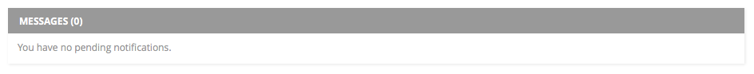

#Bloc Design Track Frontend Exercise

###Purpose
The purpose of this exercise is to understand if you would be comfortable prototyping your own interaction design work (except the design has already been done in this case). We are evaluating for potential rather than correctness of implementation, but we expect evidence of good development practices.

This exercise is designed to be completed after Frontend Foundations. Depending on where you are in the Bloc program and how much you've practiced, you may not be able to complete every task within a reasonable amount of time. **That is okay.** This exercise is meant to be challenging. Do your best and we encourage you to look up information and resources.

###A few notes
Everything you need should be in this README or in this repository. You are encouraged to propose & implement your own solutions for unclear or open-ended feature requirements.

Set aside two consecutive hours to work on this exercise independently. You should not ask your mentor for help, but this is open-book, so we encourage you to use the Bloc curriculum or google.

###The exercise
When your mentor logs on to Bloc, they see a dashboard of notifications related to their students. When mentors click on a message notification, they are taken to that message thread page. Your challenge is to create a prototype of the message notifications of the mentor dashboard using HTML, CSS, JavaScript, and jQuery.

A designer has given you the following mock and visual design spec:

**Your task is to:**

**1. Recreate the given design in HTML & CSS.**
- You may assume dimensions and margins are a multiple of 4px if they are not called out.

**2. Add the following interactions:**
- Add hover states to each interactive element.
- Allow the user to dismiss an individual notification (X) or a batch of notifications (DISMISS ALL) and update the UI live.
- Display a count of the pending notifications in the header and update the count live when notifications are dismissed.

**3. Stretch goals (only do these if you have extra time!):**
- If there are no notifications, the empty state should look like this:
 
- Use JS to dynamically load the content provided in the `data` variable.
- Add transition animations to the loading and the dismissal of notifications.
- Propose a mobile design and make the UI fully adaptive.
- Propose & implement additional features and improvements.

The above is a suggestion of steps to follow, but you are not obligated to complete them in order. 

###Submitting your exercise
Clone this repository. It includes some useful starter files and assets.

Attempt to implement as much of the exercise as possible, but restrict yourself to two hours. After two hours, stop and write a brief reflection on your work. Send your interviewer your reflection and a link to your repository within 1 week of receiving the exercise.

We will get back to you with feedback ASAP. You are encouraged to review your submission your mentor _after_ you submit and to continue working on the stretch goals for more practice.

If you have questions or feedback about this exercise, email sanny@bloc.io. Happy hacking.